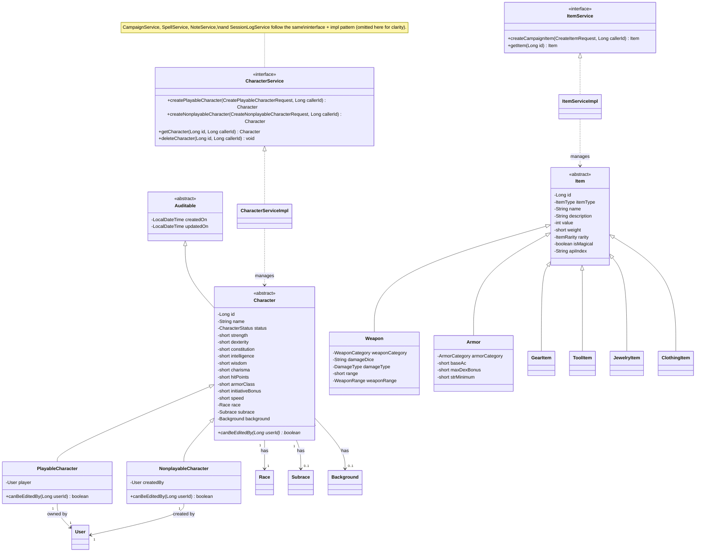
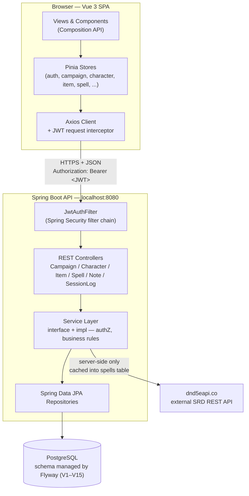

## 1. Class Diagram

Scoped to the `Character` and `Item` hierarchies plus a representative service pair, since these carry the OOP story.

**Inheritance**: `PlayableCharacter`/`NonplayableCharacter` extend `Character`; six item subtypes extend `Item`; `Character` extends `Auditable`.

**Polymorphism**: `canBeEditedBy(Long userId)` is abstract on `Character`, overridden differently per subclass. Callers invoke it without knowing the concrete type. The interface/impl split on every service is a second, structural form of polymorphism.

**Encapsulation**: Private fields with Lombok accessors, no `@Data`. Business rules live in the service layer only, so controllers can't bypass validation.

**Mapping to persistence:** `Character` uses single-table inheritance (`character_type` discriminator, two subtypes with mostly-overlapping shape). `Item` uses joined-table inheritance (6+ growing subtypes with different columns each) to avoid a wide null-heavy table.

## 2. Design Diagram (System Architecture)

#### Justification

- Everything's proxied through Spring Boot, so Vue never talks to Postgres or dnd5eapi directly. Secrets stay server-side and the dnd5eapi cache is enforced in exactly one place.
- `JwtAuthFilter` resolves authentication once per request before any controller runs.
- Authorization (i.e., membership, role, ownership) lives in services. `requireMembership()`/`requireMaster()` is reusable across `CampaignService`, `CharacterService`, `NoteService`, etc, and controllers stay thin.
- Services depend on repository interfaces instead of JPA specifics, and Pinia stores are the only frontend code that knows API response shapes. Either layer could change underneath without having to rewrite business logic.