# CampaignKeep - Software Testing Documentation

This document covers the automated **unit test** plan, the scripts that implement it, and a summary of changes that followed from testing for each test.

Manual API smoke sequences under `backend/http/` support exploratory and integration checks. They are noted briefly but are **not** the unit-test evidence set for this requirement.

**Repository:** [d424-software-engineering-capstone on GitLab](https://gitlab.com/wgu-gitlab-environment/student-repos/kthrow2/d424-software-engineering-capstone)

---

## 1. Testing approach

### 1.1 What is unit-tested

Service-layer behavior is the primary unit-test focus. Controllers stay thin; repositories and peer services are **mocked** so each test exercises business rules in isolation (authorization, caching, armor-class math, equipment rules, spell selection validation).

| Suite | File | Style | Test methods |
|-------|------|--------|--------------|
| Application smoke | `backend/src/test/java/com/kdnth/campaignkeep/CampaignkeepApplicationTests.java` | `@SpringBootTest` context load | 1 |
| Notes | `.../note/NoteServiceImplTest.java` | JUnit 5 + Mockito | 9 |
| Session logs | `.../sessionlog/SessionLogServiceImplTest.java` | JUnit 5 + Mockito | 9 |
| Spells | `.../spell/SpellServiceImplTest.java` | JUnit 5 + Mockito | 6 |
| Inventory | `.../item/InventoryServiceImplTest.java` | JUnit 5 + Mockito | 6 |

**Total:** 31 automated tests in the Maven Surefire suite.

### 1.2 Tools and stack

- **JUnit 5** (Jupiter) for test lifecycle and assertions
- **Mockito** (`@ExtendWith(MockitoExtension.class)`, `@Mock`, `@InjectMocks`) for doubles
- **Spring Boot Test** only for `CampaignkeepApplicationTests` (loads the application context)
- **Maven Surefire** (`mvn test`) to run the suite from the `backend/` module

### 1.3 Why service-layer unit tests

CampaignKeep puts authorization and domain rules in services (`requireMaster`, ownership checks, inventory constraints). Unit-testing those methods catches rule regressions without standing up PostgreSQL or HTTP for every case. That matches the product’s architecture and keeps feedback fast during development.

### 1.4 How to run tests

From the repository root:

```bash
cd backend
mvn test
```

In **IntelliJ IDEA**: open a test class (or the `backend` module), right-click -> **Run ‘Tests in ...’** / **Run ‘All Tests’**.

**Note:** Mockito’s inline mock maker needs a JVM that allows agent attachment.

**`contextLoads` (A-1) needs env vars.** That test is `@SpringBootTest` and boots Flyway/JPA against a real database. It runs only when `DB_URL` matches `jdbc:.*`. Put these on the **JUnit run configuration** (IntelliJ often does not reuse the main application’s env):

- `DB_URL` (example: `jdbc:postgresql://localhost:5432/campaignkeep`)
- `DB_USERNAME`
- `DB_PASSWORD` (may be empty)
- `JWT_SECRET` (≥ 32 characters)
- `JWT_EXP` (milliseconds, e.g. `86400000`)

If `DB_URL` is missing, A-1 is **skipped** and the 30 Mockito service tests still run. A failure saying `'url' must start with "jdbc"` means the test run saw an empty/invalid URL. Fix the run-config env. Ignore CONDITIONS EVALUATION REPORT and scroll to that root cause.

---

## 2. Unit test plan

Each plan row is one executable `@Test` method. Columns describe intent, inputs/stubs, expected outcome, and where evidence belongs.

### 2.1 Application context smoke

| ID | Test method | Objective | Expected result |
|----|-------------|-----------|-----------------|
| A-1 | `contextLoads` | Application Spring context starts with production wiring (live DB + `DB_URL` / `JWT_*`) | Passes when env is set; **skipped** when `DB_URL` is unset |


##### Initial Failure Run


##### Last Run Result
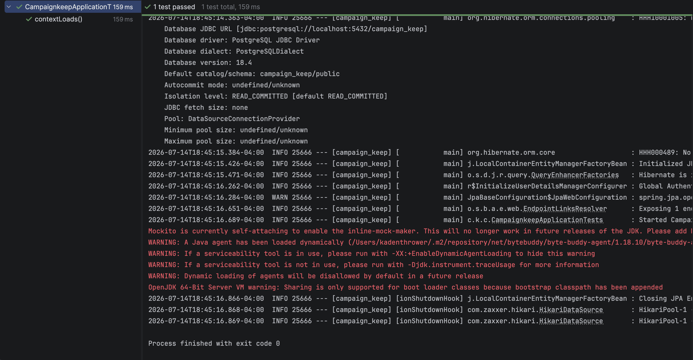

##### Summary of Changes
- Added environment variables to the `CampaignkeepApplicationTests.contextLoads` run configuration in IntelliJ.


---

### 2.2 Notes service (`NoteServiceImplTest`)

Scope: player note read/upsert; master note list/create/delete; membership and ownership guards.

| ID | Test method | Objective | Expected result |
|----|-------------|-----------|-----------------|
| N-1 | `getPlayerNote_returnsEmptyShellWhenNoNoteExists` | Missing player note returns empty shell | `id` null, `body` empty string |
| N-2 | `upsertPlayerNote_createsNoteOnFirstSave` | First save creates note + character link | Note id set; body preserved; junction saved |
| N-3 | `upsertPlayerNote_updatesExistingNote` | Second save updates body without new junction | Body updated; no extra junction save |
| N-4 | `getPlayerNote_rejectsWhenCharacterNotAttachedToCampaign` | PC must be in campaign | `NoSuchElementException` |
| N-5 | `getPlayerNote_rejectsNonOwner` | Only owning player may read | `AccessDeniedException` |
| N-6 | `listMasterNotes_requiresMaster` | Players cannot list master notes | `AccessDeniedException` |
| N-7 | `createMasterNote_persistsNoteAndLink` | Master create writes note + campaign link | Id/title set; link saved to campaign |
| N-8 | `deleteMasterNote_removesJunctionAndNote` | Master delete removes link and note | Both deletes invoked |
| N-9 | `listMasterNotes_returnsSummariesWithoutBody` | List returns summary fields | One summary with id/title (list API is summary-shaped) |

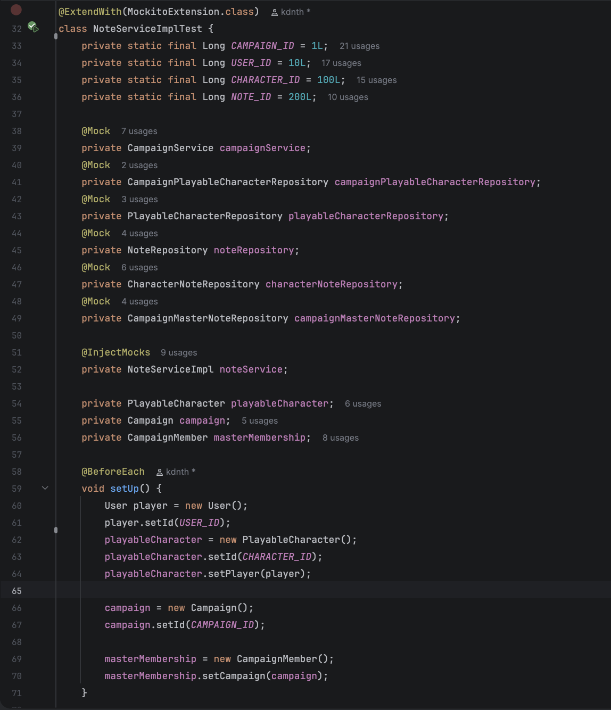
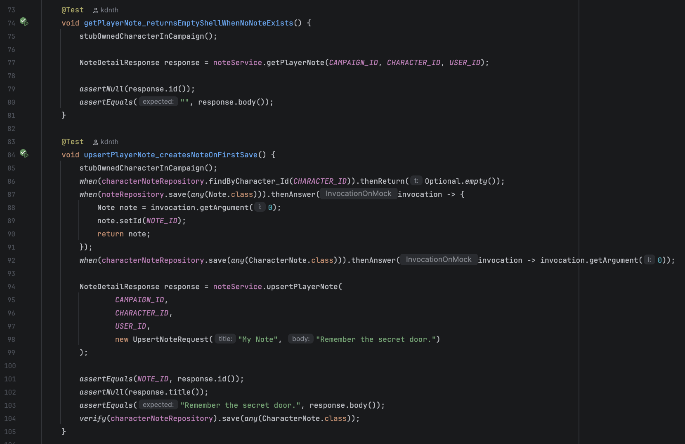
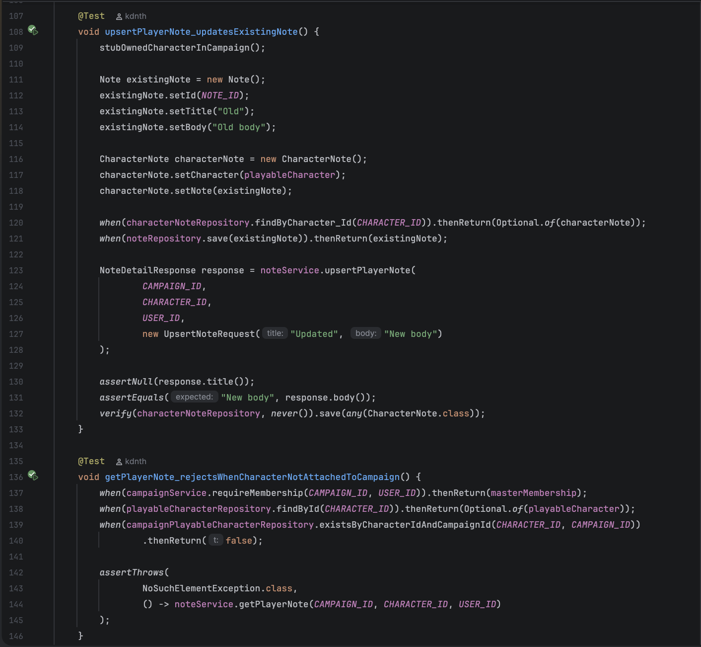
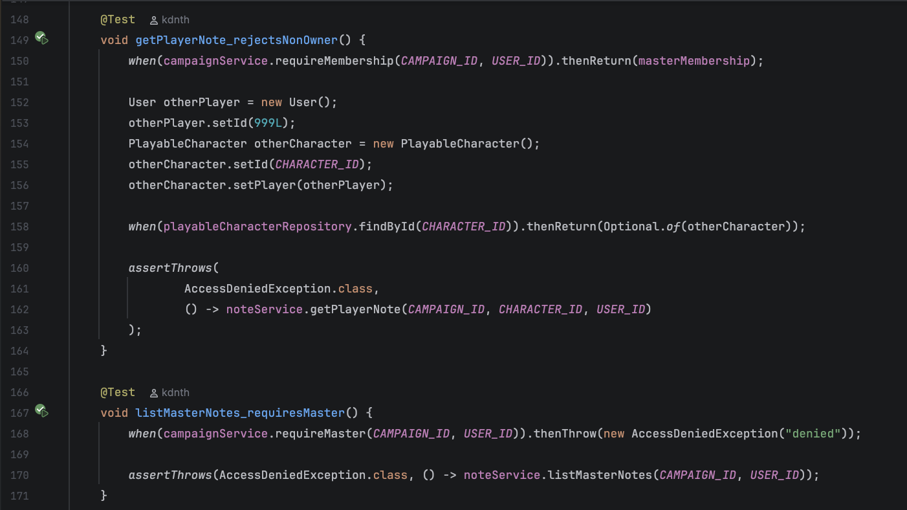
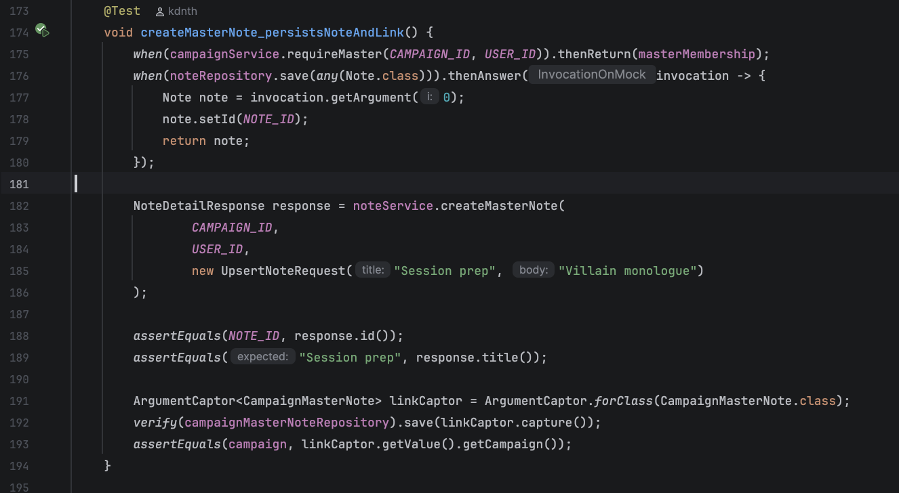
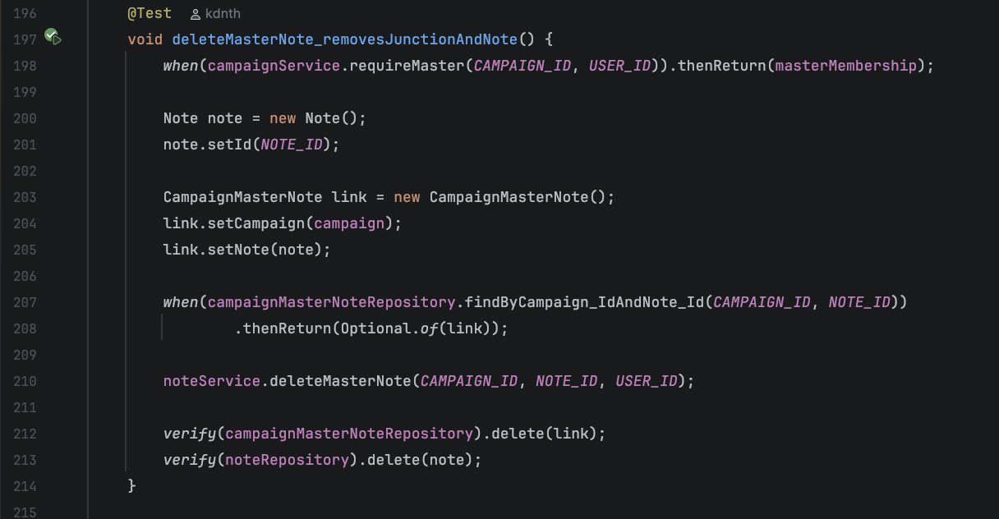
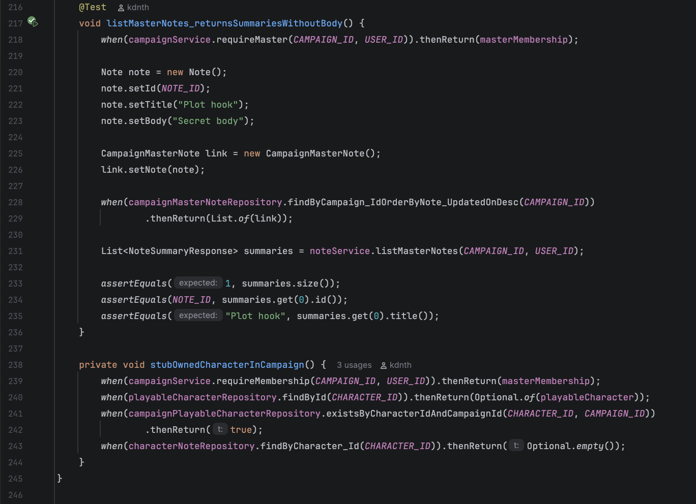

##### Last Run Result


##### Summary of Changes
- None were needed. All tests passed
---

### 2.3 Session log service (`SessionLogServiceImplTest`)

Scope: list/get for members; create/delete for master; campaign scoping (404 when wrong campaign).

| ID | Test method | Objective | Expected result |
|----|-------------|-----------|-----------------|
| S-1 | `listSessionLogs_allowsMember` | Member can list logs | One summary with expected id/title |
| S-2 | `listSessionLogs_rejectsNonMember` | Non-member blocked before repository access | `AccessDeniedException`; no repo list call |
| S-3 | `getSessionLog_allowsMember` | Member can read detail | Id, title/body match fixture |
| S-4 | `getSessionLog_returns404WhenWrongCampaign` | Log must belong to campaign | `NoSuchElementException` |
| S-5 | `createSessionLog_requiresMaster` | Player cannot create | `AccessDeniedException`; no save |
| S-6 | `createSessionLog_persistsLog` | Master create persists title, body, campaign | Response fields match; save captures campaign |
| S-7 | `deleteSessionLog_requiresMaster` | Player cannot delete | `AccessDeniedException`; no delete |
| S-8 | `deleteSessionLog_removesLog` | Master delete removes entity | `delete` called on found log |
| S-9 | `deleteSessionLog_returns404WhenWrongCampaign` | Delete scopes by campaign | `NoSuchElementException`; no delete |

##### Last Run Result
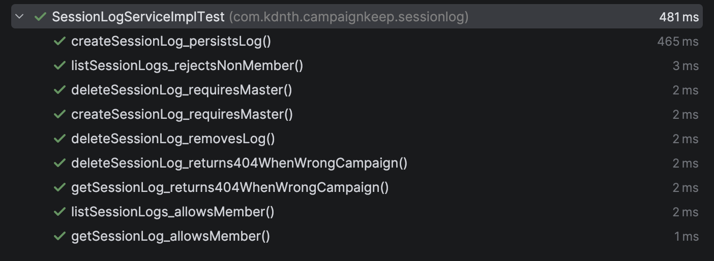

##### Summary of Changes
- None were needed. All tests passed

---

### 2.4 Spell service (`SpellServiceImplTest`)

Scope: local cache hit; dnd5eapi miss -> cache; spellbook ownership; creation-time selection rules.

| ID | Test method | Objective | Expected result |
|----|-------------|-----------|-----------------|
| SP-1 | `getSpellById_returnsCachedSpell` | Cached spell returns detail | Name and school match |
| SP-2 | `getSpellByApiIndex_fetchesAndCachesOnMiss` | Miss fetches API then saves | Name set; `save` invoked |
| SP-3 | `addSpellToCharacter_persistsLinkForOwner` | Owner can add spell | Link saved; name returned |
| SP-4 | `addSpellToCharacter_deniesNonOwner` | Non-owner cannot add | `AccessDeniedException`; no save |
| SP-5 | `validateCreationSpells_rejectsSpellsForFighter` | Fighter cannot take creation spells | `IllegalArgumentException` |
| SP-6 | `validateCreationSpells_requiresWizardCantripAndLevelOneCounts` | Wizard needs correct cantrip + level-1 counts | Incomplete list fails; full valid set passes |


##### Last Run Result
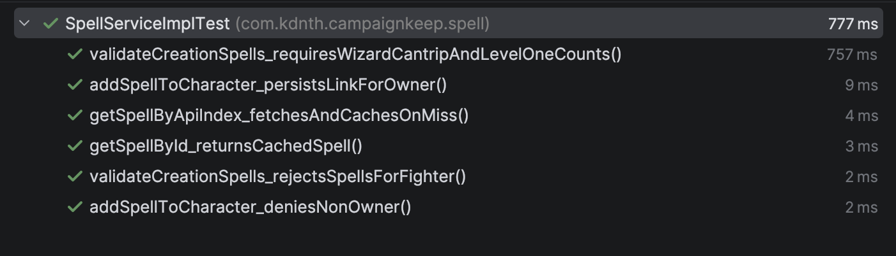

##### Summary of Changes
- None were needed. All tests passed
- 
---

### 2.5 Inventory service (`InventoryServiceImplTest`)

Scope: AC recalculation, Strength gate on armor, starting equipment flag, gold ownership, grant weight capacity.

| ID | Test method | Objective | Expected result |
|----|-------------|-----------|-----------------|
| I-1 | `recalculateArmorClass_unarmored_usesTenPlusDex` | Unarmored AC = 10 + DEX mod | AC = 12 for DEX 14 |
| I-2 | `recalculateArmorClass_lightArmorAndShield` | Leather (11 + DEX) + shield (+2) | AC = 15 |
| I-3 | `equipItem_blocksArmorWhenStrengthTooLow` | Chain mail STR 13 gate | `IllegalArgumentException` when STR 10 |
| I-4 | `submitStartingEquipment_setsFlagAndGrantsItems` | Starting kit grants item and sets flag | Flag true; item saved; character saved |
| I-5 | `updateGold_requiresOwner` | Non-owner cannot change gold | `AccessDeniedException` |
| I-6 | `grantItem_blocksWhenOverWeightCapacity` | Master grant blocked if over capacity | `ConflictException`; no inventory save |

##### Last Run Result
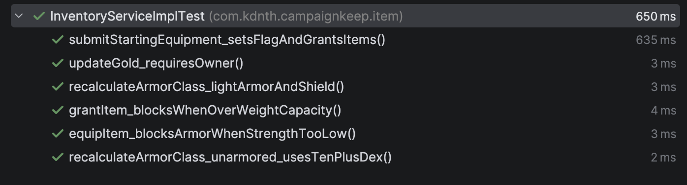

##### Summary of Changes
- None were needed. All tests passed
---

### 2.6 Full-suite plan summary

| Area | Cases planned | Pass criterion |
|------|---------------|----------------|
| Application context | 1 | Context loads |
| Notes | 9 | All methods green |
| Session logs | 9 | All methods green |
| Spells | 6 | All methods green |
| Inventory | 6 | All methods green |
| **Total** | **31** | `mvn test` **BUILD SUCCESS** |

##### Last Run Result


##### Summary of Changes
- None were needed. All tests passed
---

## 3. Unit test scripts

Scripts live under `backend/src/test/java/com/kdnth/campaignkeep/`. Run them with `mvn test` or the IDE.

### 3.1 File map

| Script path | Class under test |
|-------------|------------------|
| `CampaignkeepApplicationTests.java` | Spring Boot application bootstrap |
| `note/NoteServiceImplTest.java` | `NoteServiceImpl` |
| `sessionlog/SessionLogServiceImplTest.java` | `SessionLogServiceImpl` |
| `spell/SpellServiceImplTest.java` | `SpellServiceImpl` |
| `item/InventoryServiceImplTest.java` | `InventoryServiceImpl` |

### 3.2 Notes (structure)

Uses `@Mock` repositories and `CampaignService`, `@InjectMocks NoteServiceImpl`. Example ownership rejection:

```150:166:backend/src/test/java/com/kdnth/campaignkeep/note/NoteServiceImplTest.java
    @Test
    void getPlayerNote_rejectsNonOwner() {
        when(campaignService.requireMembership(CAMPAIGN_ID, USER_ID)).thenReturn(masterMembership);

        User otherPlayer = new User();
        otherPlayer.setId(999L);
        PlayableCharacter otherCharacter = new PlayableCharacter();
        otherCharacter.setId(CHARACTER_ID);
        otherCharacter.setPlayer(otherPlayer);

        when(playableCharacterRepository.findById(CHARACTER_ID)).thenReturn(Optional.of(otherCharacter));

        assertThrows(
                AccessDeniedException.class,
                () -> noteService.getPlayerNote(CAMPAIGN_ID, CHARACTER_ID, USER_ID)
        );
    }
```

### 3.3 Session logs (master-only create)

```115:128:backend/src/test/java/com/kdnth/campaignkeep/sessionlog/SessionLogServiceImplTest.java
    @Test
    void createSessionLog_requiresMaster() {
        when(campaignService.requireMaster(CAMPAIGN_ID, USER_ID))
                .thenThrow(new AccessDeniedException("denied"));

        assertThrows(
                AccessDeniedException.class,
                () -> sessionLogService.createSessionLog(
                        CAMPAIGN_ID,
                        USER_ID,
                        new CreateSessionLogRequest("Session 1", "Notes")
                )
        );
        verify(sessionLogRepository, never()).save(any(SessionLog.class));
    }
```

### 3.4 Spells (cache-on-miss)

```94:108:backend/src/test/java/com/kdnth/campaignkeep/spell/SpellServiceImplTest.java
    @Test
    void getSpellByApiIndex_fetchesAndCachesOnMiss() {
        when(spellRepository.findByApiIndex("fire-bolt")).thenReturn(Optional.empty());
        when(dnd5eApiClient.fetchSpell("fire-bolt")).thenReturn(apiResponse("fire-bolt", "Fire Bolt", 0));
        when(spellRepository.save(any(Spell.class))).thenAnswer(invocation -> {
            Spell saved = invocation.getArgument(0);
            saved.setId(SPELL_ID);
            return saved;
        });

        SpellDetailResponse response = spellService.getSpellByApiIndex("fire-bolt");

        assertEquals("Fire Bolt", response.name());
        verify(spellRepository).save(any(Spell.class));
    }
```

### 3.5 Inventory (AC and STR gate)

```91:134:backend/src/test/java/com/kdnth/campaignkeep/item/InventoryServiceImplTest.java
    @Test
    void recalculateArmorClass_unarmored_usesTenPlusDex() {
        when(characterItemRepository.findByCharacter_Id(CHARACTER_ID)).thenReturn(List.of());

        inventoryService.recalculateArmorClass(character);

        assertEquals(12, character.getArmorClass().intValue());
    }

    @Test
    void equipItem_blocksArmorWhenStrengthTooLow() {
        Armor chainMail = heavyArmor();
        CharacterItem item = inventoryItem(1L, chainMail);
        character.setStrength((short) 10);

        when(characterRepository.findById(CHARACTER_ID)).thenReturn(Optional.of(character));
        when(characterItemRepository.findById(1L)).thenReturn(Optional.of(item));

        assertThrows(
                IllegalArgumentException.class,
                () -> inventoryService.updateInventoryItem(
                        CHARACTER_ID,
                        1L,
                        new UpdateInventoryItemRequest(EquipmentSlot.armor, false, null),
                        USER_ID
                )
        );
    }
```

### 3.6 Application context smoke

```1:13:backend/src/test/java/com/kdnth/campaignkeep/CampaignkeepApplicationTests.java
package com.kdnth.campaignkeep;

import org.junit.jupiter.api.Test;
import org.springframework.boot.test.context.SpringBootTest;

@SpringBootTest
class CampaignkeepApplicationTests {

	@Test
	void contextLoads() {
	}

}
```

---

## 4. Unit test results (against the plan)

### 4.1 Results table

| Plan ID       | Test method | Result (fill in) | Evidence                                                                 |
|---------------|-------------|-------------|--------------------------------------------------------------------------|
| A-1           | `contextLoads` | Pass |             |
| N-1 ... N-9   | Notes suite | Pass |                 |
| S-1 ... S-9   | Session log suite | Pass |      |
| SP-1 ... SP-6 | Spell suite | Pass / Fail |  |
| I-1 ... I-6   | Inventory suite | Pass |  |
| **Suite**     | **31 tests** | Pass | 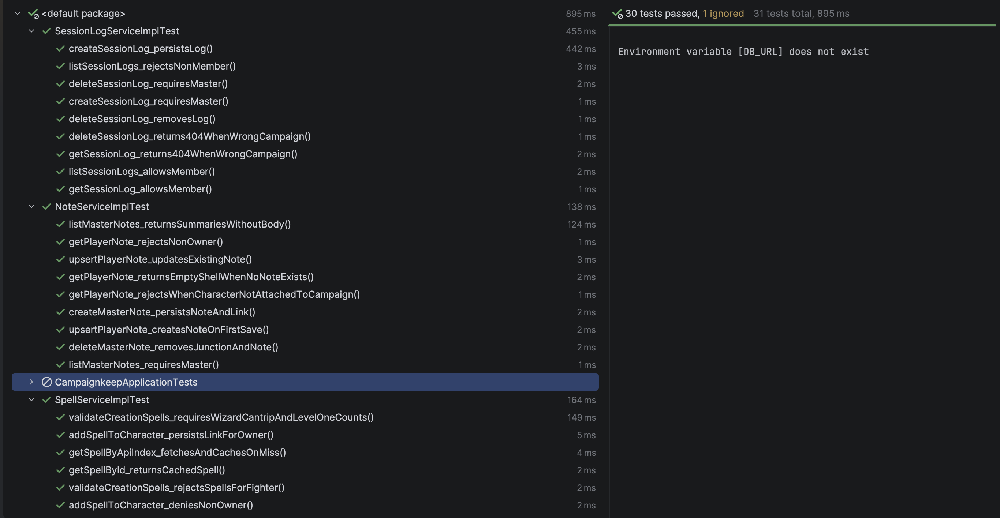             |

### 4.3 Expected healthy console excerpt

When the environment is configured correctly, Surefire should resemble:

```text
Tests run: 31, Failures: 0, Errors: 0, Skipped: 0
BUILD SUCCESS
```

If `CampaignkeepApplicationTests` fails with datasource errors, set `DB_URL`, `DB_USERNAME`, `DB_PASSWORD`, `JWT_SECRET`, and `JWT_EXP` the same way as for normal app startup, then re-run. Service suites (N/S/SP/I) do not need a live database because repositories are mocked.

---

## 6. Related documentation

| Document | Purpose |
|----------|---------|
| [User guide](./user-guide.md) | End-user workflows exercised during exploratory testing |
| [Setup and maintenance guide](./setup-and-maintenance-guide.md) | Environment required to run `mvn test` and the app |
| [Design document](./design-document.md) | OOP structure under test (services around Character/Item) |
| [README](../README.md) | Project entry point and doc index |

---

## 7. Change log for this evidence package

| Item | Location |
|------|----------|
| Unit test scripts | `backend/src/test/java/com/kdnth/campaignkeep/**` |
| This testing write-up | `docs/software-testing.md` |
| Screenshots | Insert in sections **2** and **4** where marked |
